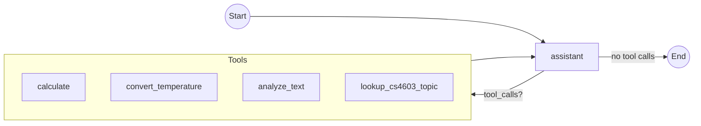
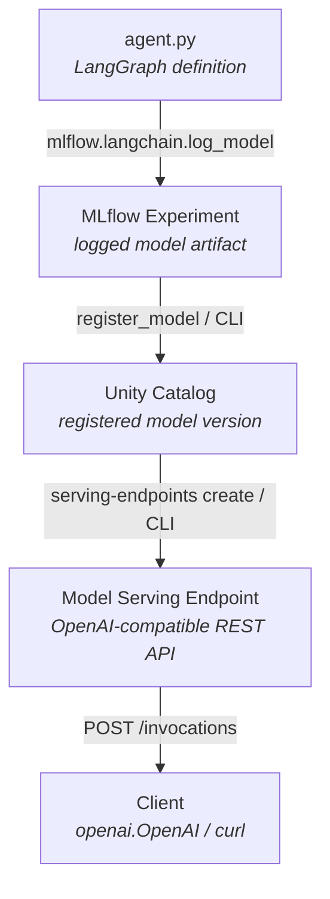

# 11. Databricks Deployment

Deploy a LangGraph agent as a **Databricks Model Serving endpoint** — packaging the graph with MLflow and serving it via the same OpenAI-compatible API used throughout the course.

## Files

| File | Purpose |
|------|---------|
| `agent.py` | Self-contained LangGraph CS4603 study assistant with 4 tools (calculate, temperature conversion, text analysis, course topic lookup). MLflow serializes this file directly via models-from-code. |
| `deploy_setup.sh` | **CLI deployment script** — uses Databricks CLI for model registration and endpoint management. |
| `deploy_setup.py` | Python deployment script — alternative to the shell script; uses the Python SDK. |
| `deployment.ipynb` | Interactive notebook walkthrough of the full deployment pipeline (define → log → test → register → serve → call). |

## Prerequisites

1. **Databricks CLI** installed and authenticated:
   ```bash
   pip install databricks-cli
   databricks auth login --host https://<your-workspace>.databricks.com
   ```

2. **Python environment** with project dependencies:
   ```bash
   uv venv -n .venv-cs4603
   .venv-cs4603\Scripts\activate        # Windows
   source .venv-cs4603/bin/activate     # macOS/Linux
   uv pip install -r requirements.txt
   ```

3. **`.env` file** at the repo root with:
   ```
   DATABRICKS_TOKEN="dapi..."
   DATABRICKS_HOST="https://<workspace-id>.databricks.com"
   DATABRICKS_MODEL="databricks-qwen35-122b-a10b"
   ```

## Deployment Steps

### Option A — Shell Script (Databricks CLI)

The recommended approach. Run from the **repo root**:

```bash
bash wk5_langgraph/11.databricks_deployment/deploy_setup.sh
```

**What it does:**

| Step | Action | Tool |
|------|--------|------|
| 1 | Resolve your Databricks username | `databricks current-user me` |
| 2 | Log the agent model to MLflow | Python (minimal inline — no CLI equivalent) |
| 3 | Register the model in Unity Catalog | `databricks registered-models create` / `databricks model-versions create` |
| 4 | Create or update the serving endpoint | `databricks serving-endpoints create` / `update-config` |

**Options:**

```bash
# Custom model name and endpoint:
bash wk5_langgraph/11.databricks_deployment/deploy_setup.sh \
    --model-name main.default.my_agent \
    --endpoint-name my-agent-endpoint

# Skip endpoint creation (just log + register):
bash wk5_langgraph/11.databricks_deployment/deploy_setup.sh --skip-endpoint
```

### Option B — Python Script

```bash
python wk5_langgraph/11.databricks_deployment/deploy_setup.py
python wk5_langgraph/11.databricks_deployment/deploy_setup.py --model-name my_agent --skip-endpoint
```

### Option C — Interactive Notebook

Open `deployment.ipynb` in VS Code or Databricks and run cells sequentially. This is best for learning — each step is explained inline.

## Architecture

### Agent Graph



### Deployment Pipeline



## Verifying the Deployment

**Check endpoint status:**
```bash
databricks serving-endpoints get cs4603-langgraph-agent
```

**Test with curl:**
```bash
curl -X POST "${DATABRICKS_HOST}/serving-endpoints/cs4603-langgraph-agent/invocations" \
  -H "Authorization: Bearer $DATABRICKS_TOKEN" \
  -H "Content-Type: application/json" \
  -d '{"messages": [{"role": "user", "content": "Convert 100F to Celsius"}]}'
```

**Test with Python:**
```python
import openai

client = openai.OpenAI(
    api_key=DATABRICKS_TOKEN,
    base_url=f"{DATABRICKS_HOST}/serving-endpoints",
)

resp = client.chat.completions.create(
    model="cs4603-langgraph-agent",
    messages=[{"role": "user", "content": "What is RAG in the context of LLMs?"}],
)
print(resp.choices[0].message.content)
```

## Troubleshooting

| Issue | Fix |
|-------|-----|
| `DATABRICKS_HOST must be set` | Create a `.env` file at the repo root (see Prerequisites) |
| `databricks: command not found` | `pip install databricks-cli` and run `databricks auth login` |
| Endpoint stuck in `NOT_READY` | Wait a few minutes — first cold start takes time; check logs in Databricks UI under Serving |
| `PERMISSION_DENIED` on UC | Ask your workspace admin for `USE CATALOG` + `CREATE MODEL` on the target catalog/schema |
| Model logging fails | Ensure `agent.py` imports cleanly: `python -c "import importlib.util; s=importlib.util.spec_from_file_location('a','agent.py'); m=importlib.util.module_from_spec(s); s.loader.exec_module(m)"` |
